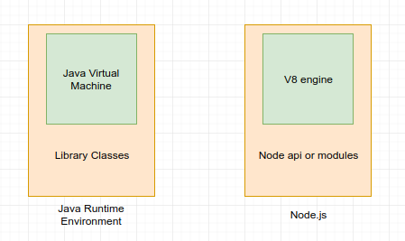
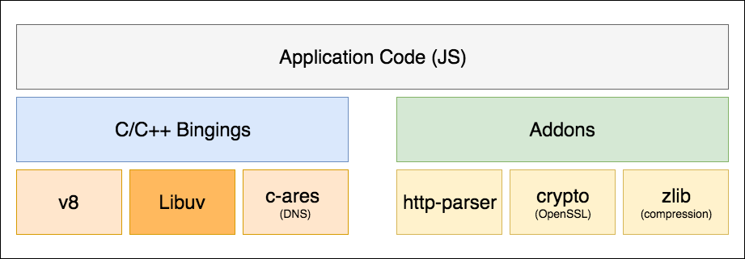
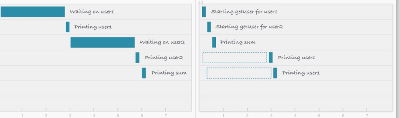
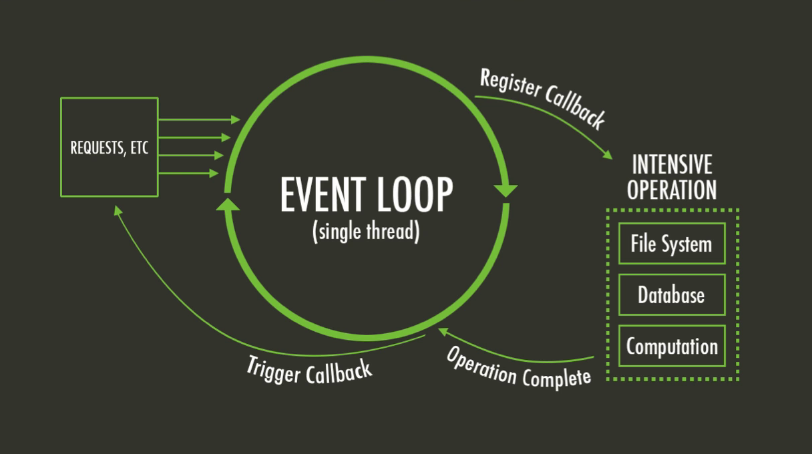

<!-- $theme: default -->
<!-- class: invert -->
<!-- $size: 16:9 -->


# Node js 101

---

# ¿What is node?

---


Node.js is an open-source, cross-platform, JavaScript runtime environment that executes JavaScript code outside of a browser. 

* Could be used for command line tools, scripting and for server-side services.
* Is a single threaded engine which in background uses multiple threads to execute asynchronous code.
* Opens the way to "JavaScript everywhere" paradigm.
* Node.js uses an event-driven and non-blocking I/O model that makes it lightweight and efficient.


---


* Node.js is a runtime, like JRE is

---

### Node.js parts



* JavaScript is generally considered an interpreted language, but modern JavaScript engines no longer just interpret JavaScript, they compile it.
* V8 provides the runtime environment in which your JavaScript app executes
* The I/O operations are handled by libuv

---

#### V8 engine


* V8 is written in C++, and it’s continuously improved. It is portable and runs on Mac, Windows, Linux and several other systems.
* JavaScript is internally compiled by V8 with **just-in-time (JIT)** compilation to speed up the execution.

---
#### Libuv



* Non-blocking I/O, you can initiate a data request without waiting for the response to any other request, in a nutshell, you can initiate i/o requests in parallel.

* This eliminates the need for multi-threading since the server can handle multiple requests at the same time.

---

#### Resumen



---

#### Resumen


---


> Node.js’ package manager, npm, is the largest ecosystem of open source libraries in the world.

> npm have over 1.000.000 packages.
> npm is the maven of javascript

---

## How to write a node app

app.js
``` js
  console.log('Hello world');
```

Execute it
``` bash
$ node app.js
Hello world
$ 
```

--- 
### Hello http world!
``` js
const http = require('http');
const server = http.createServer((request, response) => {
    response.writeHead(200);
    response.write('Hello http world!');
    response.end();
})

server.listen(8080);
````


---
### Package definition

`package.json` is the `.pom` of node.
``` json
  {
    "name": "package_name",
    "description": "Package description",
    "version": "1.0.0"
  }
```

---

### Package definition

package.json example
``` json
{
  "name": "package_name",
  "description": "Package description",
  "version": "1.0.0",
  "scripts": {
    "start": "node app.js --some --params -i"
  },
  "dependencies": {
    "some-dependency": "^3.0.1",
    "other-one": "^4.12.0"
  }
}
```

---

### node modules

* node_modules is the folder in which npm save all the delendencies and subdependencies of your node app.
* If you try to import a package inside node, it will try to found it inside node_modules.


---

## JS, weird things

* Everything is an object in Javascript, including functions (excepts primitives).

```js
function executeFunction(func, a, b) {
  func(a, b);
}

function suma(a,b) {
	return a + b;
}

function multiplica(a,b) {
	return a * b;
}

executeFunction(suma, 2, 3); // 5
executeFunction(multiplica, 2, 3); // 6

```

---
#### Functions as parameters

```js
function getFunc() {
  let value = "test";
  let func = function() { alert(value); }; //anonimous function asigned to a variable
  return func;
}

getFunc()(); // "test"
```

---

```js
let sum = new Function('a', 'b', 'return a + b');

alert( sum(1, 2) ); // 3
```

---

### Java to JS

https://github.com/sanguino/node-for-java-developers/blob/master/Java2ES6.md

---

#### Callbacks

A callback is a function that is passed to another function. When the first function is done, it will run the callback function.

``` js
var fs = require("fs");
var data = fs.readFileSync('input.txt');

console.log(data.toString());
console.log("Program Ended");

//file content
//Program Ended
```

``` js 
var fs = require("fs");

fs.readFile('input.txt', function (err, data) {
   console.log(data.toString());
});

console.log("Program Ended");

//Program Ended
//file content
```

---

### Callback hell

``` js
function httpClient (resource, cb) {
  const baseURL = 'http://domain.com/api/'
  return http.get(baseURL + resource, cb)
}

httpClient('users/1' function (user) {
  httpClient('posts/' + user.id, function (post) {
    httpClient('coments/' + post.id, function (comment) {
      httpClient('likes/' + comment.id, function (like) {
        httpClient('anotherResource/' + like.id, function (data) {
          console.log(data)
        })
      })
    })
  })
})
```
---

### Promises

``` js
httpClient('users/1')
.then(user => httpClient('posts/' + user.id)) 
.then(post => httpClient('coments/' + post.id))
.then(comment => httpClient('likes/' + comment.id))
.then(like => httpClient('anotherResource/' + like.id))
.then(result => {
  console.log(result)
})
.catch(data => {
  console.error(data)	
});
```
---
### Promises
``` js
function httpClient (resource, cb) {
  const baseURL = 'http://domain.com/api/'
  return http.get(baseURL + resource, cb)
}
```
``` js 
function httpClient (resource) {
  const baseURL = 'http://domain.com/api/'
  return new Promise((resolve, rejection) => {
    $.get(baseURL + resource, (data) => {
      resolve(data)
    })
    .fail(function(err) {
      rejection(err)
    })
  })
}
```
---
### Async await
```js
async function getSomething () {
    const user = await httpClient('users/1')
    const post = await httpClient('posts/' + user.id)
    const comment = await httpClient('coments/' + post.id)
    const like = await httpClient('likes/' + comment.id)
    const result = await httpClient('anotherResource/' + like.id)
    console.log(result)
}
getSomething();
```
---

### Promises all
```js
const promises = [
    httpClient('users/1'),
    httpClient('users/2'),
    httpClient('users/3'),
    httpClient('users/4'),
    httpClient('users/5')
];
Promise.all(promises).then(users => { 
  console.log(users);
}).catch(err => { 
  console.log(err)
});
```
---
# todo-app


---

### clustering - node

``` js 
const cluster = require('cluster');
const http = require('http');
const numCPUs = require('os').cpus().length;

if (cluster.isMaster) {
  console.log(`Master ${process.pid} is running`);
  for (let i = 0; i < numCPUs; i++) {
    console.log(`Forking process number ${i}...`);
    cluster.fork();
  }
} else {
  console.log(`Worker ${process.pid} started and finished`);
}
process.exit();
```

``` bash
$ node app.js

Master 8463 is running
Forking process number 0...
Forking process number 1...
Forking process number 2...
Forking process number 3...
Worker 8464 started and finished
Worker 8465 started and finished
Worker 8467 started and finished
Worker 8466 started and finished
```

---

### clustering - PM2


PM2 is a production process manager for Node.js applications with a built-in load balancer. It allows you to keep applications alive forever, to reload them without downtime and to facilitate common system admin tasks.

Starting an application in production mode is as easy as:

``` bash
$ pm2 start app.js
```

Clustering an application is as easy as:
``` bash
$ pm2 start app.js -i max
```

PM2 will load balance your cluster.

---

### clustering conclusions

Clustering your Node.js applications to be scaled accross all CPUs available, without any code modifications, so you could have 1 node in each core, using all the capacity of your server.

* If you use docker, don't use pm2 inside your containers.
* If your app is an api rest calling a db, or anyother node stateless app, clustering is a good idea in any case, it will have better performance with low code cost.
* If your app have state, you will need any other piece to share the state between the cluster. Redis use to be a good idea, it's fast and easy to use in node.

---

# Thanks!!

