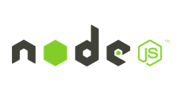

<!-- $theme: default -->
<!-- class: invert -->
<!-- $size: 16:9 -->


# Node js

---

# ¿Que es node?

---



Node.js is an open-source, cross-platform, JavaScript runtime environment that executes JavaScript code outside of a browser. 

* Could be used for command line tools, scripting and for server-side services.
* Is a single threaded engine which in background uses multiple threads to execute asynchronous code.
* Opens the way to "JavaScript everywhere" paradigm.
* Node.js uses an event-driven and non-blocking I/O model that makes it lightweight and efficient.


---


* Node.js is a runtime, like JRE is

---

### Node.js parts


* JavaScript is generally considered an interpreted language, but modern JavaScript engines no longer just interpret JavaScript, they compile it.
* V8 provides the runtime environment in which your JavaScript app executes
* The I/O operations are handled by libuv

---

#### V8 engine


* V8 is written in C++, and it’s continuously improved. It is portable and runs on Mac, Windows, Linux and several other systems.
* JavaScript is internally compiled by V8 with **just-in-time (JIT)** compilation to speed up the execution.

---
#### Libuv


* Non-blocking I/O, you can initiate a data request without waiting for the response to any other request, in a nutshell, you can initiate i/o requests in parallel.

* This eliminates the need for multi-threading since the server can handle multiple requests at the same time.

---

#### Resumen


---

#### Resumen


---


> Node.js’ package manager, npm, is the largest ecosystem of open source libraries in the world.

> npm have over 1.000.000 packages.

---

## How to write a node app

app.js
``` js
  console.log('Hello world');
```

Execute it
``` bash
$ node app.js
Hello world
$ 
```

--- 
### Hello http world!
``` js
const http = require('http');
const server = http.createServer((request, response) => {
    response.writeHead(200);
    response.write('Hello http world!');
    response.end();
})

server.listen(8080);
````


---
### Package definition

package.json
``` json
  {
    "name": "package_name",
    "description": "Package description",
    "version": "1.0.0"
  }
```

---

### Package definition

package.json
``` json
{
  "name": "package_name",
  "description": "Package description",
  "version": "1.0.0",
  "scripts": {
    "start": "node app.js --some --params -i"
  },
  "dependencies": {
    "some-dependency": "^3.0.1",
    "other-one": "^4.12.0"
  }
}
```

---

### node modules


---


Package.json
Scripts

https://medium.com/laboratoria-how-to/node-js-javascript-y-el-inicio-al-lado-oscuro-del-desarrollo-193b8cac9bed

¿Como ejecuta node?
Mono hilo, no bloqueante

Es6
Clases
Arrows
===


Callbacks

Promesas

Async Await


PM2


Clustering en node
Forks y cia

Express js

Api test en node


https://dzone.com/articles/node-cluster?utm_medium=feed&utm_source=feedpress.me&utm_campaign=Feed:%20dzone%2Fwebdev

What Is Node.js for Java Developers


---

# Muchas gracias


